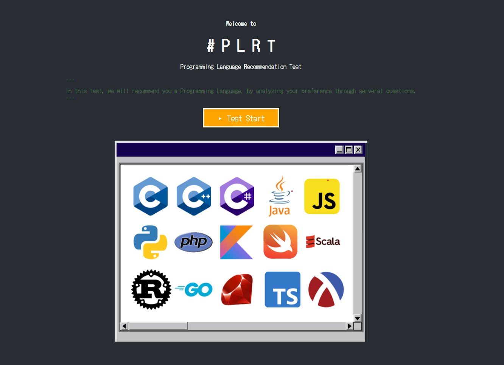
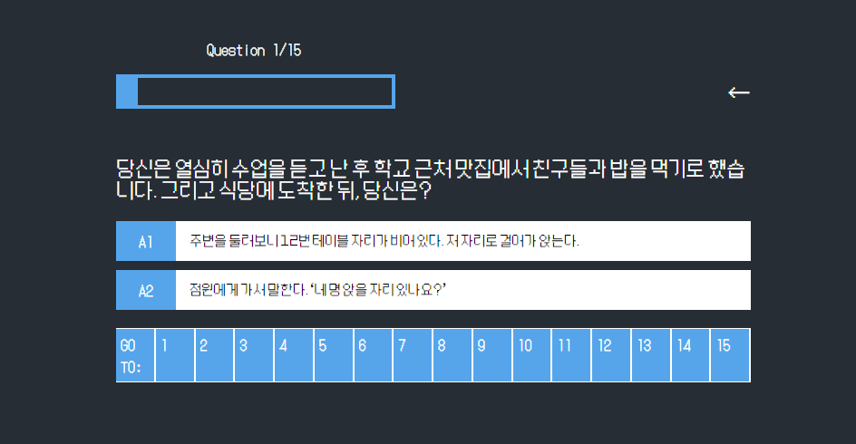
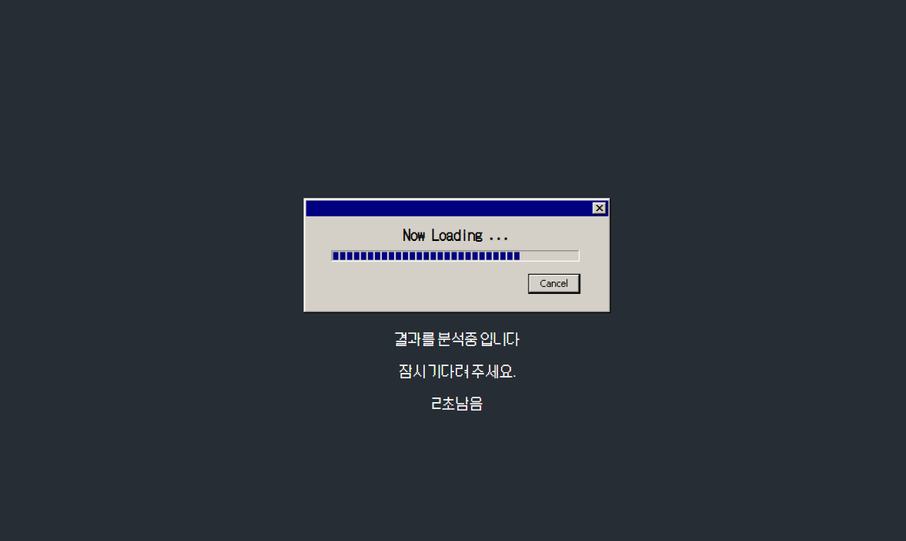
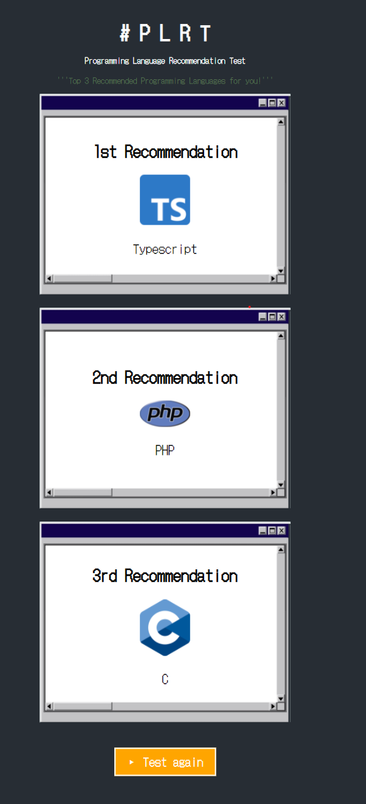
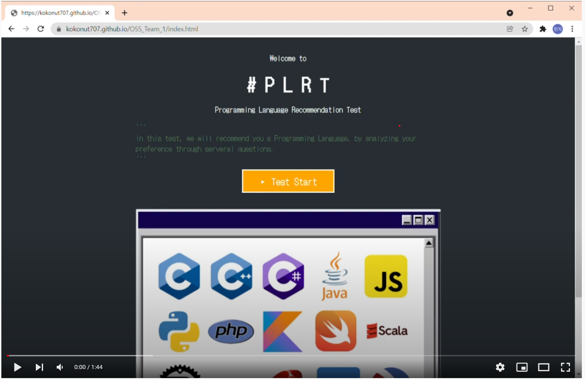

# P L A T 

[GO TO TEST!](https://kokonut707.github.io/OSS_Team_1/index.html)

```
"PLAT" is the wep page for programming language recommendation to people who first come to CS engineering.
```



```
At first, the user faces the start page.
```



```
When user press the start button, face the survey page as follows.
and user can go back or go to priveous question by back space button or GO TO: (number) button.
```



```
Wait a moment after answering all 15 questions.
```



```
Our algorithm has a weighted matrix of 15x15x2 for 15 languages and 15 answers with weights per question.

For the answer selected by the user, three of the highest weights are selected and shown as recommendations 1, 2, and 3, respectively.

Therefore, the user just starts the test and answers 15 questions, and the recommendation algorithm works to recommend an appropriate programming language.

If you want to retest, just press the test again button.
```


[](https://youtu.be/YcKhsQUoSDw?t=0s) 

```
This is our demo video and we hope you to find a good Programming Language.
```

